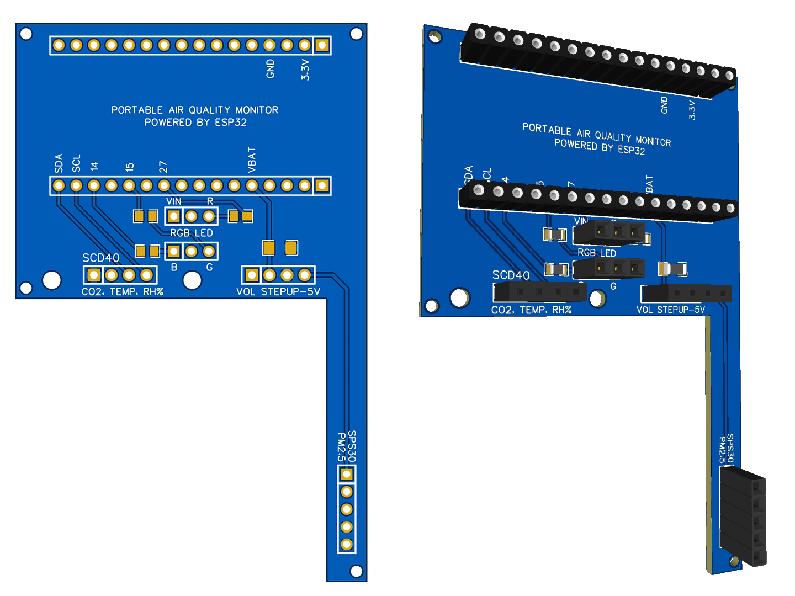
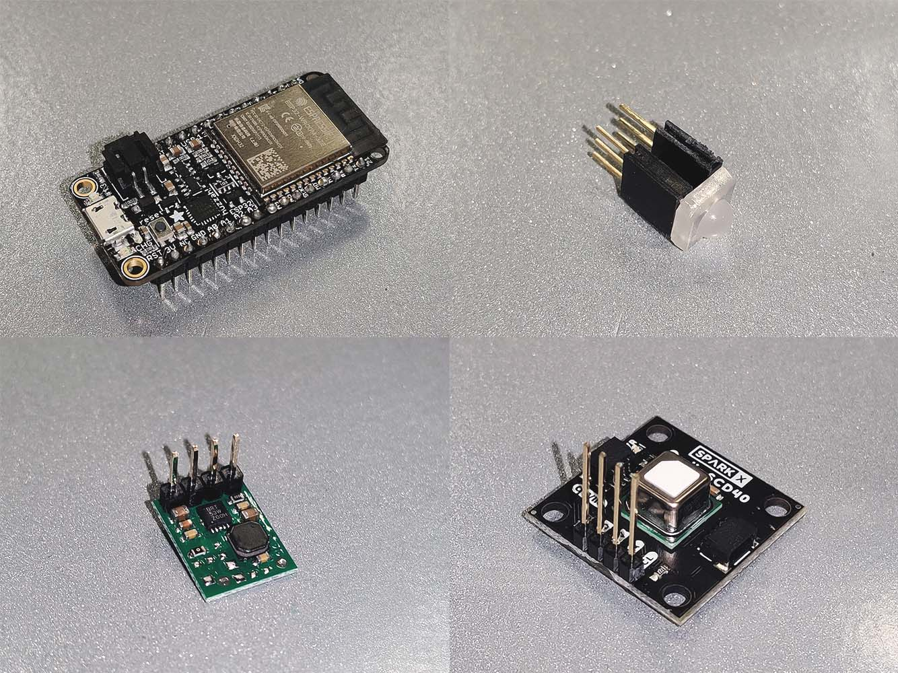

# Open-source portable air quality monitor
```
Topics covered:  
Arduino IDE, ESP32, BLE, 3D-printing, PCB-fabricating 
```

## Table of contents
#### [1. Overview](#1-overview-1)
#### [2. Hardware specifications](#2-hardware-specifications-1)
#### [3. Hardware fabrication](#3-hardware-fabrication-1)
#### [4. Software implementation](#4-software-implementation-1)
  
#### Summary of important links
[Electronic components](#summary-of-hardware-components)
  
[PCB design (EasyEDA)](https://oshwlab.com/vtn238/portable-air-quality-monitor_copy_copy/)
  
[Enclosure design (Fusion 360)](/enclosure-design-fusion-360)

## 1. Overview
This documentation details the specifications and steps necessary to build **myAQM**, a  portable personal air quality monitor **(AQM)** that can be interfaced with an iOS/watchOS application.
  
**myAQM** was designed with the following properties in mind:
### 1.1. User experience:
- **Monitoring a comprehensive set of indoor/outdoor air quality markers**
    - Particulate matter < 2.5μm (PM2.5)
    - CO2 carbon dioxide
    - Thermal comfort: temperature and humidity
- **Portable**
    - Weighs less than ...
    - Full-day battery life, multiple-day if further optimized
    - Can be carried around on a backbag or other personal items with a hook / clip
- **Communicating with an iOS/watchOS app through Bluetooth Low-Energy (BLE)**
    - BLE comsumes less power than Wi-Fi
    - Allows for continuous data monitoring with the iOS/watchOS app no matter where the users go (as opposed to the limit range and accessibility of Wi-Fi networks)
- **High-fidelity prototype: functionally and aesthetically polished**
    - Custom-made PCB design
    - Custom-made 3D-printed enclosure
### 1.2. Developer experience:
- **Minimal form factor and easy fabrication**
    - Minimal number of components, most components are in breakout boards for easy fabrication and debugging 
    - Minimalistic and modular design which means electronic components can be re-used, re-purposed, or swapped out if broken
- **Open-source**
    - While **myAQM** was designed to be interfaced with Apple devices (iOS/watchOS) and used on-the-go, its hardware and source-code can be re-purposed for different monitoring setups (Wi-Fi connection, stationary station...)
  
## 2. Hardware specifications
**myAQM** hardware broadly consists of:
- A microcontroller (Adafruit ESP32)
- Environmental sensors
- Other electronic components
- Custom PCB, 3D enclosure, and some M1.6 x 6mm nuts
  
The choice for each of these components is discussed below, with unaffiliated links for purchase.
  
<p align="center">
  
</p>
  
### Summary of hardware components
| Jump to section | Description | Price* | Link
| --- | --- | --- | --- |
| [Adafruit ESP32](#21-adafruit-esp32-microcontroller) | Microcontroller with BLE | $19.95 | [Adafruit](https://www.adafruit.com/product/3405) |
| [Sensirion SPS30](#sensirion-sps30-particulate-matter) | Compact low-cost optical particulate matter sensor | $46.95 | [SparkFun](https://www.sparkfun.com/products/15103) |
| [Sensirion SCD40](#sensirion-scd40-co2-temp-and-humid) | Photoacoustic CO2 sensor, with temp and humid sensor | $49.95 | [SparkFun](https://www.sparkfun.com/products/18365) |
| [Pololu U1V11F5](#pololu-5v-step-up-voltage-regulator-u1v11f5) | 5V step-up voltage regulator for SPS30 | $6.95 | [Pololu](https://www.pololu.com/product/2562) |
| [Adafruit Diffused Piranha LED (pack of 10)] | Air quality index indicator | $0.995/cnt | [Adafruit](https://www.adafruit.com/product/1451) |
| [LilyPad Slide Switch](#onoff-switch) | On/off switch | $1.85 | [SparkFun](https://www.sparkfun.com/products/9350) |
| [2500mAh Li-Po Battery](#li-po-battery) | Rechargeable battery | $14.95 | [Adafruit](https://www.adafruit.com/product/328) |
| **Total** | (excluding consumables and fabrication cost) | $142 |  |
```
_*Price and availability as of Dec 2021_
```
### Schematics
  
<p align="center">
  
</p>
  
### 2.1. Adafruit ESP32 microcontroller
<p align="center">
  
</p>
  
Adafruit ESP32 Feather Board microcontroller was chosen for the portable air quality monitor for its:
- Support of different wireless communication protocols: WiFi and Bluetooth Low-Energy (BLE)
- Intergrated battery charger and circuit protection (compared to the vanilla ESP32)
- Easy integration with the Arduino IDE platform

### 2.2. Environmental sensors
#### Sensirion SPS30 (particulate matter)
<p align="center">
  
</p>
  
**Why measuring particulate mattter?**
  
Air pollution is the 4th leading factor for premature death, claiming over 6 million lives worldwide in 2019<sup>[1]</sup>. Microscopic particulate matter smaller than 2.5 micrometers (PM2.5) is among the most hazardous forms of outdoor and indoor air pollution. PM2.5 particles can penetrate and lodge into our lungs and internal organs<sup>[2]</sup>, causing respiratory and cardiovascular diseases. It is estimated that more than 90% of the world population live in areas where annual PM2.5 concentrations exceed the guildlines put forth by the World's Heath Organization (WHO)<sup>[1]</sup>.
  
Sensirion SPS30 particulate matter sensor is chosen for its relative accuracy among other similar low-cost optical sensors and for its compactness for this highly-portable monitor. Research has indicated a good correlation between SPS30's measurements with those from reference instruments<sup>[3], [4]</sup> It comes with both I2C and UART communication protocols, which makes it extremely versatile for any application. We'll use I2C in this case.

#### Pololu 5V Step-Up Voltage Regulator U1V11F5
<p align="center">
  
</p>
This voltage regulator is used to step up the 3.7V nominal output (3.4V - 4.2V experimentally) from the Li-Po battery to 5V required to power up the SPS30 sensor. It is chosen for its small size and conversion efficiency.

#### Sensirion SCD40 (CO2, temp, and humid)
<p align="center">
  
</p>
  
**Why measuring CO2?**
  
CO2 concentration is a powerful indicator of indoor air quality as it is a by-product of human respiration process. Exposure to high indoor CO2 concentrations (>1000ppm, new research even indidates at >600-700ppm) have been linked with a reduction in cognitive performance<sup>[5],[6]</sup>. High indoor CO2 levels indicate low fresh air intake which increases the risk of airborne diseases (such as COVID-19) in highly-pollutated indoor environment<sup>[7]</sup>. Low indoor ventilation also results in the build-up of other harmful pollutants such as votatile organic compounds (VOCs), radons, molds, and so on.
  
This Sensirion SCD40 CO2 sensor employs break-through technology in photoacoustic sensing. It is considerably smaller and more energy-efficient than a typical NDIR (nondispersive infrared) sensor ([See SCD30](https://www.sensirion.com/en/environmental-sensors/carbon-dioxide-sensors/carbon-dioxide-sensors-scd30/)). Due to its recent debut in 2021, the SparkFun breakout board is currently an experimental product; however, it works particularly well from our experience.
  
The sensor also comes equipped with a temprature and humidity sensor, which eliminates the need for a separate sensor, making the system more streamlined.
  
The sensor uses I2C protocol.

### 2.3. Other electronic components
#### Li-Po battery
<p align="center">
  
</p>
This high capacity 2500mAh Li-Po battery from Adafruit can be connected directly to the Adafruit ESP32 board. It is also equipped with circuitry protection for our peace of mind. It can be recharged using the built-in circuit on the Adafruit ESP32 with any over-the-counter microUSB cable.
  
Alternatively, any other Li-Po battery can be used, provided it comes with a 2-pin JST PH connector.
  
The calibration of the battery (voltage to percentage) is discussed in section [4.5. Calibrating Li-Po battery](#45-calibrating-li-po-battery)
#### LED indicator
<p align="center">
  
</p>
This RGB LED indicator is used to display current air quality index (using US AQI) for at-a-glance information. This feature can also be used when the portable air quality monitor is not connected with an iOS/watchOS app for us to read its measurements.
  
<p align="center">
  
</p>
  
**myAQM** does not come with a small LCD display on the air quality like other DIY monitors as it focuses on the visualization of the data on the iOS/watchOS app. However, users are encouraged to tailor the open-source design to their preferences.

#### On/off switch
<p align="center">
  
</p>
  
This component is quite self-explainatory.
  
## 3. Hardware fabrication
### 3.1. Custom PCB
**myAQM** is designed with the motherboard-daughterboards philosophy:
- It allows for easy plug-and-play of the various breakout boards that we purchase from Adafruit/SparkFun...
- It allows for quick debugging during prototyping and re-use/re-purpose after the prototyping process of such breakout components. For example, if the CO2 sensor fails, another one can be swapped in with little effort.
- All while achieving a highly-polished and durable MVP that is not achievable if using breadboards or protoboards
  
<p align="center">
  
</p>

The custom PCB is designed using **EasyEDA**, an online editor with functionalities similar to other CAD software. The design is sent to **JLC PCB** (Shenzhen, China) for fabrication. The advantages of this approach is its fast turn-over time for quick prototyping; surface-mounted components (resistors, capacitors) and through-hole components (female recepticles) can be selected from EasyEDA and are automatically soldered on the PCB boards by JLC, which eliminates the need for additional soldering.
  
[Here](https://oshwlab.com/vtn238/portable-air-quality-monitor_copy_copy/) is the link to all the files and parts needed to construct the PCB with EasyEDA and JLC PCB.
  
#### Below is an overview of the PCB design process:
  
A graphic schematic for all the electronic components is laid out:
  
<p align="center">
  
</p>
  
We then design a corresponding schematic on EasyEDA, with most of the components swapped out for female recepticle parts (which can be found on [JLC PCB](https://jlcpcb.com/parts)):
  
<p align="center">
  
</p>
  
In addition to the female recepticles that will connect to the electronic components, there are three `330Ω` resistors to limit the current going though the RGB LED (one for each color) and a `47μF` capacitor close to the voltage regulator (between `VIN` - `GND`)to prevent LC voltage spikes. The final design is a 2-layered simple PCB.
  
<p align="center">
  
</p>
  
*2D and 3D renders of the PCB with SMT components and female recepticles soldered in place*
  
### 3.2. Custom 3D-printed enclosure
The enclosure is designed in **Fusion 360**. The Fusion 360 project can be found [here](), in case any modification is needed.
  
<p align="center">
  
</p>
  
#### Some design choices:
  
<p align="center">
  
    <br/><i>The battery is placed in a separate partition to avoid overheating other components</i>
</p>
  
  
<p align="center">
  
  <br/><i>Similarly, the ESP32 board is placed at the highest position (as heat rises)</i>
</p>
  
  
<p align="center">
  
  <br/><i>The SPS30 is positioned such that "Inlets should always be above outlet to avoid particles getting back from the outlet to the inlets due to gravity" - <a href="misc/PS_AN_SPS30_Mechanical_Design_and_Assembly_Guidelines_v10_D2.pdf">Mechanical Design and Assembly Guidelines for SPS30</a></i>
</p>
  
  
<p align="center">
  
  <br/><i>A hook is added on top of the enclosure. A clip is added on the back of the enclosure. Both of which can be used to attach the portable air quality monitor to the users' backpack, belts, or any other personal items that they often carry around during a typical day</i>
</p>
  
  
<p align="center">
  
    <br/><i>Some perforated slits to supply fresh air</i>
</p>
  

<p align="center">
  
<br/><i>Optionally, some plastic mesh can be used to cover the slits to avoid big debris/dust particles to enter the interior</i>
</p>
  
### 3.3. Putting everything together
As explained before, the design objective of the portable air quality monitor is modular and reusable. The PCB board already comes installed with the female recepticles; therefore, we only need to solder male staight headers into *most* of the sensors:
  
<p align="center">
  
  <br/><i>ESP32, RGB LED, Pololu 5V Step-up voltage regulator, and SCD40 CO2 sensor (left to right, top to bottom)</i>
</p>
  
  
Meanwhile, the SPS30 particulate matter sensor purchased from SparkFun comes with a JST-ZHR Cable - 5-pin x 1.5mm Pitch to Breadboard connector (spare can be found [here](https://www.sparkfun.com/products/15108)). As a work-around, for our PCB board, we trim the 5 wires and solder them into a male header so that they can be plugged into the corresponding female recepticles:
  
<p align="center">
  
</p>
  
The RGB LED and the SCD40 is connected to another set of female recepticles before being connected to the recepticles soldered on the PCB. The reason is to create clearance for the SCD40 sensor from the SPS30 sensor underneath, while for the LED, the second set of female recepticles brings it closer to the front cover of the enclosure. This is how the board looks like after everything is plugged into:
  
<p align="center">
  
</p>
  
The red (positive) wire of the Li-Po battery is then soldered into the switch like such:
  
<p align="center">
  
</p>
  
The slider switch can then be mounted onto the back of the 3D-printed enclosure with two M1.6 x 6mm nuts, together with the battery in the back compartment:
  
<p align="center">
  
</p>

Similarly, the motherboard PCB can be secured onto the front of the 3D-printed enclosure with four M1.6 x 6mm nuts, with the SPS30 sensor fits snuggly in its own comparment:
  
<p align="center">
  
</p>
  
Afterwards, the front cover can be mounted in place, with four M1.6 x 6mm nuts at each corner, with the LED slightly protrudes into the cutout on the front cover:


Lastly, the 3D-printed clip can be held secured onto the back cover with a pair of M1.6 nuts and bolts. The back cover can then be mounted with four additional M1.6 nuts:


  

  
Optionally, a ring hook can be installed like below:


## 4. Software implementation
The entire Arduino project of the portable air quality monitor can be found [here](https://github.com/myAQM/myAQM/arduino-code).
  
Before the project can be flashed to the ESP32, the [ESP32 Platform](https://docs.espressif.com/projects/arduino-esp32/en/latest/installing.html) should be added to the Arduino IDE and [drivers for Adafruit ESP32](https://learn.adafruit.com/adafruit-huzzah32-esp32-feather/using-with-arduino-ide) should be installed.
  
This documentation assumes a basic working knowledge of the Arduino IDE platform.
  
### 4.1. Software overview

  
### 4.2. Getting data from the sensors
Two Arduino libraries are used to get measurements from SPS30 and SCD40:
- [SparkFun SCD4x Arduino Library](https://github.com/sparkfun/SparkFun_SCD4x_Arduino_Library)
- [Arduino library for Sensirion SPS30](https://github.com/Sensirion/arduino-sps)
Methods to return the measurements are encapsulated in `.cpp` and `.h`. The methods are quite straight-forward as they are pulled directly from respective Arduino libraries for those Sensirion sensors.

### 4.3. Implementing BLE connection
>For tutorial on [Bluetooth Low-Energy on ESP32](https://randomnerdtutorials.com/esp32-bluetooth-low-energy-ble-arduino-ide/)

### 4.4. Implementing SPIFFS permanent data storage
>For tutorial on [SPIFFS](https://randomnerdtutorials.com/install-esp32-filesystem-uploader-arduino-ide/#:~:text=The%20ESP32%20contains%20a%20Serial,like%20the%20ESP32%20flash%20memory.)
  
For use cases where the portable air quality monitor is not connected to the iOS/watchOS app, we need to store data locally and opportunistically upload the logged data once a reconnection is established. One solution is to use a microSD card breakout board. However, to avoid complicating the prototype at this point, we decide to use the internal memory onboard the ESP32 microcontroller instead.
  
The onboard permanent memory is called SPIFFS, and it has 1MB memory of storage. While this might seem abysmal, it is worth noted that a record only consumes some tens of bytes. 1MB is more than enough for days of continuous logging before a re-connection is established. After all, this is only intended for when there is no connection with the phone app and not for long term storage, which will be handled by the iOS/watchOS app.

Functions to deal with SPIFFS tasks are located in the `.ino` file as they did not work when being encapsulated in a seperate header file. The 4 functions are:
- `void setup_SPIFFS()`: Initialize the SPIFFS partition, format the SPIFFS if the initialization fails (this can be deactivated via the variable `FORMAT_SPIFFS_IF_FAILED` in the `configs.h` file). To be called in the `void setup()` function in the `.ino` file.
- `void deleteFile(fs::FS &fs, const char * path)`: Remove the temporary data file after finishing uploading the data to the iOS/watchOS app to free up space.
- `void appendFile(fs::FS &fs, const char * path, const char * message)`: Append new measurement to `FILENAME` (can be changed in `configs.h`). This function takes the message to be appended as a `char` array.
- `void readFileToUpdateBleCharacteristics(fs::FS &fs, const char * path)`: Read the data file line by line to upload the data via BLE to iOS/watchOS app.

### 4.5. Calibrating Li-Po battery
Since Li-Po batteries exhibit a non-linear relationship between voltage vs. charge, it is necessary to calibrate them to roughly extrapolate battery percentage from voltage measurement taken from ESP32. On [Adafruit ESP32 documentation](https://learn.adafruit.com/adafruit-huzzah32-esp32-feather/power-management), the battery voltage ADC pin is the A13 (35 for Arduino code).
  
>Since the ESP32 has tons of ADC pins, we 'sacrifice' one for Lipoly battery monitoring. You can read half of the battery voltage off of A13. Don't forget to double the voltage you read, since there is a divider.
  
The calibration process is done by letting the whole system run continuously from full-charge to battery dead, which lasts ~16 hours during our early prototyping phrase. Every hour, we measure simultaneously the true voltage (with a multimeter between BAT and GND pin) and the calculated voltage from ADC pin. The calibration process for this 2500mAh Li-Po battery involves two steps:
#### 4.5.1. Converting calculated voltage from ADC pin to true voltage
Battery voltage from ADC reading can be calculated with this formula:
```
CALCULATED_VOL = (ADC_READING / 4095) * 3.3V * 2
```  
where **ADC_READING** is the analog measurement from A13 pin. This has to be divided by 4095 since ESP32 is a 10-bit system, then multiplied by 3.3V since ESP32 operating voltage is 3.3V, then doubled as stated in the ESP32 documentation.
  
However, this value does not necessarily reflects the true voltage measured with a multimeter due to ADC attenuation. To fix this issue, we plot true measured voltage vs. calculated voltage (from ADC pin) and plotted this linear regression chart for a conversion formula:
  
<p align="center">
  
</p>
  
#### 4.5.2. Converting true voltage to percentage level
With the true voltage (which ranges from 3.4V to 4.2V), we now proceed to correlate the battery voltages to the battery percentages. To approximate the battery percentage consumed over each hour, we divided 100% by the number of hours that the system lasts until battery dead, assuming the power consumption stays relatively constant throughout the process. We then plot this 3<sup>rd</sup> degree polynomial regression chart, which gives an excellent R<sup>2</sup> value:
  
<p align="center">
  
</p>
  
Solving for battery percentage at any given voltage then, however, requires us to solve this 3<sup>rd</sup> degree polynomial equation on the fly, which is notoriously complicated:
```
y = ax^3 + bx^2 + cx + d
```
where y is the true voltage and x is the battery percentage we are interested in.
  
Due to energy saving and calculation power concern, we decide to calculate in advance a 5%-increment look-up table for the conversion instead and save this in the Arduino sketch:
| True voltage (V) | Battery percentage |
| --- | --- |
| 4.183 | 1.00 |
| 4.104 | 0.95 |
| 4.034 | 0.90 |
| ... | ... |
| 3.476 | 0.10 |
| 3.437 | 0.05 |
| 3.393  | 0.00 |
```
// Look-up table array for battery percentage from true battery voltage
// 5% increment
// #define BATTERY_LEVELS_NUM 21
const float battery_levels[BATTERY_LEVELS_NUM] = {
4.183, 4.104, 4.034, 3.972,
3.917, 3.869, 3.826, 3.788, 
3.754, 3.724, 3.696, 3.670,
3.645, 3.621, 3.596, 3.570,
3.541, 3.510, 3.476, 3.437, 3.393
};
```
We assume a 5% increment look-up table should achieve a good memory usage while still giving users enough high-resolution data on the battery level.
#### Remark:
If a different battery model is used, this two-step battery calibration must be carried out again.
### 4.6. (Alternative) Implementing WiFi connection with ThingSpeak server
As mentioned, ESP32 is a powerful microcontroller with BLE and Wi-Fi capabilities. For any application that requires Wi-Fi as the sole/hybrid mode of communication, one can easily integrate ThingSpeak IoT platform to **myAQM** without having to set up one's own server nor database. Tutorials can be found on [Mathworks](https://www.mathworks.com/help/thingspeak/measure-arduino-wifi-signal-strength-with-esp32.html) and [RandomNerdTutorials](https://randomnerdtutorials.com/esp32-thingspeak-publish-arduino/). We are not going to discuss the actual technical implementation here; however, the only modification to the source code would be to substitute the BLE code with the Wi-Fi and ThingSpeak code, all else stay the same.
  
---
## Reference
1. State of Global Air 2020. Special Report. Boston, MA: Health Effects Institute; 2020
2. Li, Donghai, et al. “Fluorescent Reconstitution on Deposition of PM2.5 in Lung and Extrapulmonary Organs.” *PNAS*, National Academy of Sciences, 12 Feb. 2019, [https://www.pnas.org/content/116/7/2488](https://www.pnas.org/content/116/7/2488)
3. Sousan, Sinan, et al. “Laboratory Evaluation of Low-Cost Optical Particle Counters for Environmental and Occupational Exposures.” *Sensors*, vol. 21, no. 12, 2021, p. 4146., [https://doi.org/10.3390/s21124146](https://doi.org/10.3390/s21124146). 
4. *Sensirion - SPS30 Eval Kit*, South Coast AQMD, [http://www.aqmd.gov/aq-spec/sensordetail/sensirion---sps30-eval-kit](http://www.aqmd.gov/aq-spec/sensordetail/sensirion---sps30-eval-kit)
5. 
6. 
7. 